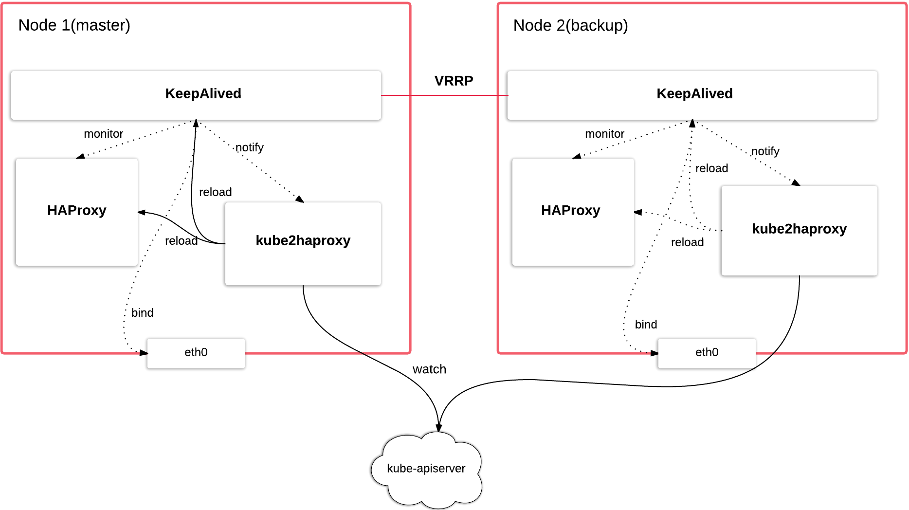

# kube2haproxy

kube2haproxy is a daemon process that automatically configures Keepalived&HAProxy for services deployed on Kubernetes.

It features:
* High Availability HAProxy, support ip failover.
* Auto configure Keepalived&HAProxy configuration files based your template. You can provision your own template in production to enable SSL and notifications.
* Efficient Keepalived&HAProxy reload with controlled rate.
* Developed in Golang, deployment on Keepalived&HAProxy instances has no additional dependency.
* Integrates with [Prometheus](https://github.com/prometheus/prometheus) to monitor metrics.

## Theory of Operation

Compared with kube-proxy(also noted as distributed proxy), kube2haproxy runs locally on node of central HAProxy cluster and is responsible for HAProxy configuration update and reload. kube2haproxy watches `kube-apiserver` for service&endpoints resources change, and reload HAProxy in rate limited manner. To support high availability, we use Keepalived, kube2haproxy is also responsible for Keepalived configuration update and reload. The following diagram demonstrates how this worked in a 2 nodes cluster:

## Build

TODO

## Configuration

TODO

## Monitoring

TODO
